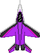

<!-- PROJECT LOGO -->
 

  

  <h3 align="center">Ace Of Aces</h3>

  

    :airplane: Крутая игра про самолетики :airplane:
     
    <a href="https://github.com/El-Donte/AceOfAces">View Demo</a>
    &middot;
    <a href="https://github.com/El-Donte/AceOfAces/issues/new?labels=bug&template=bug-report---.md">Report Bug</a>
    &middot;
    <a href="https://github.com/El-Donte/AceOfAces/issues/new?labels=enhancement&template=feature-request---.md">Request Feature</a>
  

<!-- TABLE OF CONTENTS -->

  
Содержание

  <ol>
    <li>
      <a href="#о-проекте">О проекте</a>
      <ul>
        <li><a href="#сделано-с-помощью">Сделано с помощью/a></li>
      </ul>
    </li>
    <li>
      <a href="#getting-started">Getting Started</a>
    </li>
    <li><a href="#roadmap">Roadmap</a></li>
    <li><a href="#контакты">Контакты</a></li>
  </ol>

<!-- ABOUT THE PROJECT -->
## О проекте

Данный проект был создан в качестве задания по программированию в университет (УрФУ). 
Игра из себя представляет простой арканоид, где игрок управляет самолетом пытаясь уворачиваться от врагов и их ракет для того чтобы набрать как можно больше очков.

Используйте `README.md` чтобы начать.

(<a href="#readme-top">Назад к началу</a>)

###  Сделан с помощью

* Monogame

(<a href="#readme-top">Назад к началу</a>)

<!-- GETTING STARTED -->
## Getting Started

Просто скачать релизную версию проекта

(<a href="#readme-top">Назад к началу</a>)

<!-- ROADMAP -->
## Roadmap

- [x] Добалено лого
- [ ] Добавлены звуки
- [ ] Добавлены очки и система рекордов
- [ ] Проработка анимаций
- [ ] Релиз проекта

(<a href="#readme-top">Назад к началу</a>)

<!-- CONTACT -->
## Контакты

Никита Абатуров - [@eI_donte](https://t.me/eI_donte) - nikitaabaturov49@gmail.com

Project Link: [https://github.com/El-Donte/AceOfAces](https://github.com/El-Donte/AceOfAces)

(<a href="#readme-top">Назад к началу</a>)

[Angular.io]: https://img.shields.io/badge/Angular-DD0031?style=for-the-badge&logo=angular&logoColor=white
[Angular-url]: https://angular.io/
[Svelte.dev]: https://img.shields.io/badge/Svelte-4A4A55?style=for-the-badge&logo=svelte&logoColor=FF3E00
[Svelte-url]: https://svelte.dev/
[Laravel.com]: https://img.shields.io/badge/Laravel-FF2D20?style=for-the-badge&logo=laravel&logoColor=white
[Laravel-url]: https://laravel.com
[Bootstrap.com]: https://img.shields.io/badge/Bootstrap-563D7C?style=for-the-badge&logo=bootstrap&logoColor=white
[Bootstrap-url]: https://getbootstrap.com
[JQuery.com]: https://img.shields.io/badge/jQuery-0769AD?style=for-the-badge&logo=jquery&logoColor=white
[JQuery-url]: https://jquery.com 
